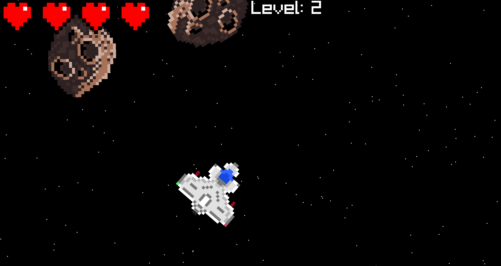

# Jogo Asteroids em C

Este jogo foi criado como um desafio meu para ver o que consigo fazer com apenas ANSI C 99.
Ele foi criado com a biblioteca [Raylib](https://github.com/raysan5/raylib) em mais ou menos 550 linhas de código. Também usa memória dinâmica, coisa que eu queria aprender na prática como utilizar.

Seja livre para criar uma _fork_. Caso descubra algum bug ou algo assim no jogo, reporte. Caso tenha alguma sugestão para o jogo, pode dar (embora eu considere esse projeto como acabado, já que tem como objetivo copiar um jogo de Atari).

O código tem a licensa GPLv3, veja com mais detalhes no arquivo [LICENSE](LICENSE).

Para compilar o jogo, instale o Raylib. Como eu uso macOS, eu só baixei com o Homebrew:

```
brew install raylib
```

Não sei se existe esse pacote em gerenciadores de pacote para Linux. Qualquer coisa você pode compilar pelo código-fonte.

Você também pode modificar o _Makefile_ para compilar o Raylib estaticamente, deixando o jogo mais portátil.

Depois, é só digitar no terminal:

```
make
```

Vai aparecer um arquivo chamado `asteroids` . Para executar, você pode ou digitar `./asteroids` ou `make run`.